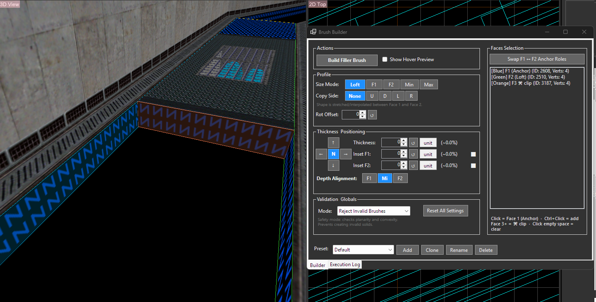

HammerTime.BrushBuilder (Gap Filler)
===================================

> [!WARNING]
> ### ⚠️ Experimental Release Candidate (RC) & Format Notice
> **Developed using AI with the active participation of the repository owner.**
>
> This plugin is currently in an experimental Release Candidate (RC) state. As HammerTime and other editors (like J.A.C.K.) evolve, there is a minor theoretical risk of format deviations. Due to continuous development and improvements, the UI/UX is subject to change.
>
> To ensure maximum safety for your primary work and prevent potential data loss (e.g. during modifications to the JMF format), please keep in mind that subtle incompatibilities could occur.
>
> **For absolute reliability, you can:**
> 1. Save your map files in the standard `.map` format.
> 2. Alternatively, perform complex alignment operations in a separate temporary map using a simple orthogonal reference brush (such as a 90° block) as an anchor, then copy the aligned geometry back to your primary editor.

---

### Description

**BrushBuilder** is a plugin for the HammerTime editor designed to automatically construct connecting geometry (gap filling) between two selected brush faces.

**Key Features:**
- **Gap Filler Tool**: Automatically fills the volume between two faces (designated as Blue and Green Face).
- Supports various size modes (Stretch/Loft, Flat, Match Ratio) and alignment settings.
- Interactive control over alignment and thickness using direction keys (`↑↓←→`) and Center (`N`).
